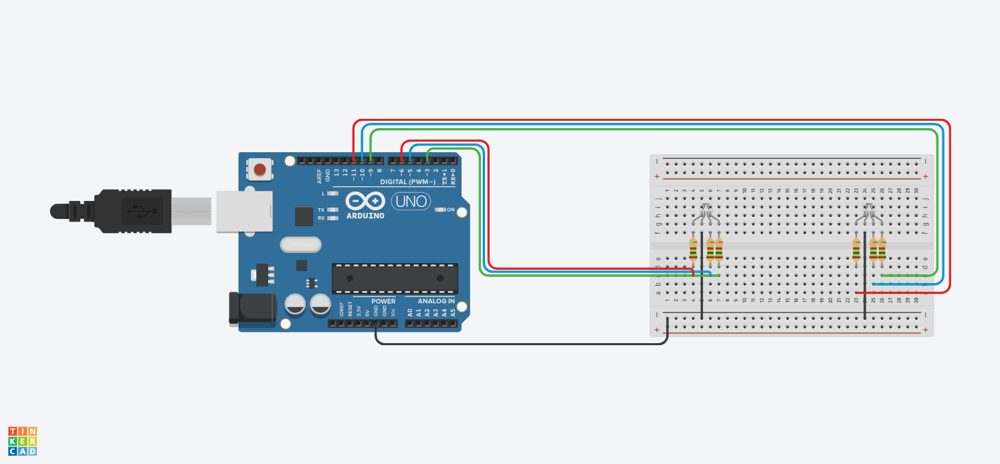

# Leds piscantes

## intrudução
Este projeto mostra como usar um Arduino Uno R3 juntamente com Leds para fazer-lós piscar em intervalos determinados de tempo!
## matériais 
É preciso apenas:
Um Arduino Uno R3;
Dois Leds RGB;
Seis resistores;
Nove fios para fazer as ligações;
Uma placa de ensaio.

## explicação do código
int R = 6; // porta vermelha
int G = 3; // porta verde
int B = 5; // porta azul
int Red = 11;
int Green = 9;
int Blue = 10;

void setup()
{
 pinMode(R,OUTPUT); 
 pinMode(G,OUTPUT);
 pinMode(B,OUTPUT);
  
 pinMode(Red,OUTPUT); 
 pinMode(Green,OUTPUT);
 pinMode(Blue,OUTPUT);
}

void loop()
{
  //geração de números aleatórios
  int v1= random(0,255);
  int v2= random(0,255);
  int v3= random(0,255);
 
  
  analogWrite(R,v1);
  analogWrite(G,v2);
  analogWrite(B,v3);
  delay(50);
 
  analogWrite(Red,v1);
  analogWrite(Green,v2);
  analogWrite(Blue,v3);
  delay(50);
  
}

